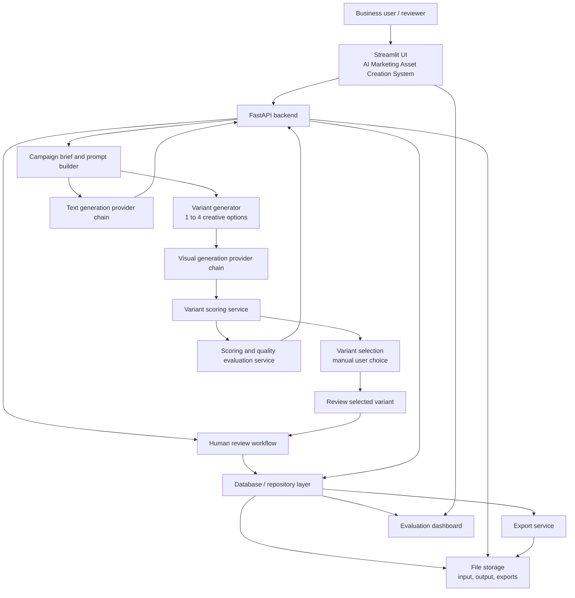

# Architecture

## System Overview

The application is organized as a Streamlit front end that calls a FastAPI backend. The backend orchestrates image generation, copy generation, scoring, review, persistence, and export.

## Mermaid Diagram

## Component Responsibilities

### Streamlit UI

- Provides the Studio, Review, Library, Evaluation, and About tabs
- Collects campaign brief and prompt controls
- Shows generated assets, review checklist, and library cards
- Supports demo mode when external services are unavailable

### FastAPI Backend

- Receives upload and generation requests
- Validates inputs and stores asset records
- Serves file downloads and export packages
- Handles review updates and evaluation records

### Campaign Brief / Prompt Builder

- Converts business-friendly campaign inputs into structured prompts
- Applies layered identity lock and negative constraints
- Keeps product preservation higher priority than scene styling
- Supports optional reference-photo guidance without letting the reference override the product photo

### Variant Generator

- Creates 1 to 4 visual variants from the same campaign brief
- Adds variant-specific creative direction without changing product identity
- Marks the best-scoring variant as recommended for manual selection

### Variant Scoring and Selection

- Scores each variant and labels it for review readiness
- Lets the user manually choose the final variant before review and export
- Persists the selected variant alongside the campaign record

### Optional Reference Photo Path

- Product photo is treated as the identity image
- Reference photo is treated as the style / layout image
- Providers that support multiple image inputs can use both images directly
- Providers that do not support multi-image conditioning still receive the reference guidance through the prompt and stored metadata
- The UI keeps the feature optional so the one-click preset flow still works without extra setup

### Visual Generation Provider

- Generates the campaign image
- Preserves product identity when possible
- Falls back safely if the configured provider fails

### Text Generation Provider

- Produces platform-aware copy
- Returns claim-safety guidance
- Summarizes visible product facts for marketing use

### Scoring / Quality Evaluation Service

- Computes a 0-100 quality score
- Produces quality summaries and review guidance
- Supports the evaluation dashboard

### Human Review Workflow

- Compares original and generated images
- Compares original product photo against the selected generated variant
- Records approve, revise, or reject decisions
- Stores reviewer notes and checklist data

### Database / Repository Layer

- Persists asset metadata, events, review decisions, and evaluation results
- Keeps the campaign library and dashboard data queryable

### File Storage

- Stores uploaded product images
- Stores generated images and exports
- Keeps artifacts available for review and download

### Export Service

- Bundles the campaign package into a ZIP file
- Includes metadata, copy, quality report, and images

### Evaluation Dashboard

- Summarizes asset counts, approval status, score trends, and publishability
- Helps communicate the assisted-production nature of the system

## Design Principles

- Business users first, developers second
- Human review before publication
- Prompt structure before raw prompt length
- Stable demo behavior before experimental completeness
- Clear separation between UI, orchestration, and storage
